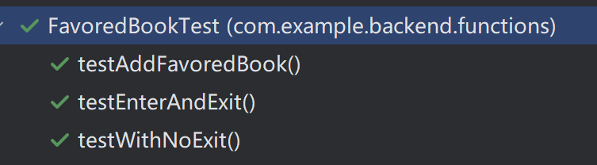

## 目标:测试整个系统的集成和实际数据库交互的能力， 使用真实数据库可能更为适合。原因：
1. 这样可以更好地模拟实际生产环境中的情况，并且能够确保系统在与实际数据库交互时的可靠性和性能
2. 可以确保测试的准确性和真实性，并验证系统在特定数据库环境下的行为

## 测试流程：
1. 在测试函数之前，先导入测试数据到数据库中。
2. 按照“将一本书加入书架-进入阅读-退出阅读”的流程，测试这几个步骤
3. 除了正常进入退出，还测试了进入之后没有向退出接口发送信息的情况（即前端异常退出），结果发现，对于没有正常退出的那次阅读，阅读进度和阅读时间都没有记录到。为了应对这种情况，选择前端定时发送信息至后端，这样可以减少数据的丢失
4. 测试结束后，清空数据库，清空表中信息，但不删除表本身。

## 测试结果：

